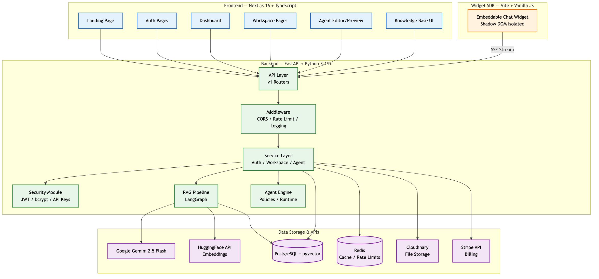
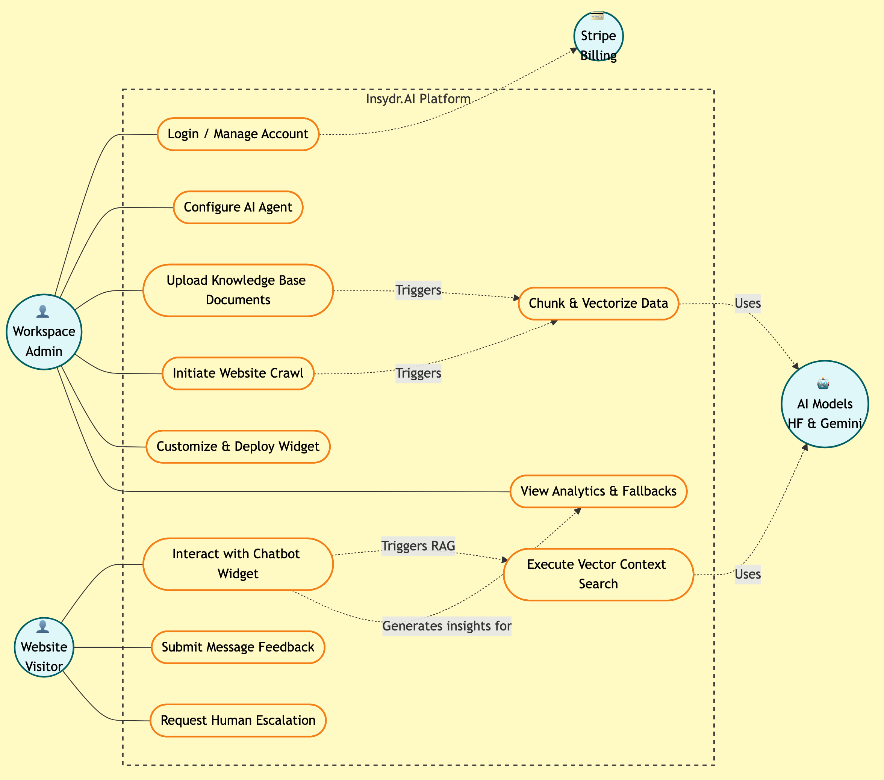
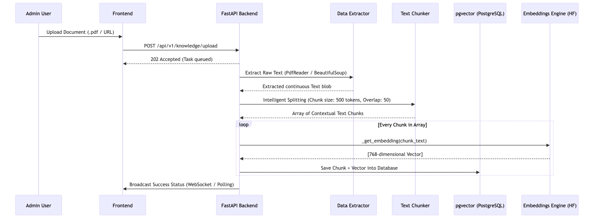
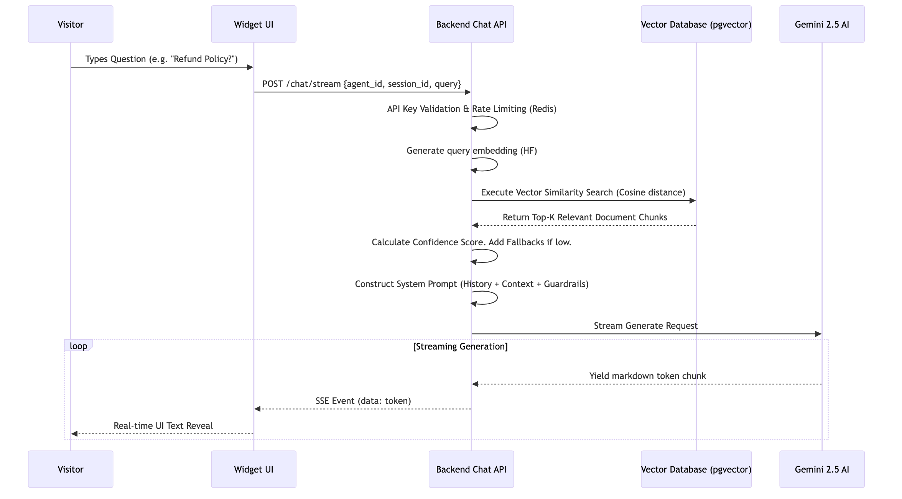

# INSYDR.AI - AI CHATBOT PLATFORM
## A PROJECT REPORT

**Submitted by**

Tarun Nagpal (ID No: _______)

**In partial fulfillment for the award of the degree of**
**B. TECH. in COMPUTER ENGINEERING**

**4CP33: Full Semester External Project (FSEP)**

**BIRLA VISHVAKARMA MAHAVIDYALAYA**
**(ENGINEERING COLLEGE)**
**(An Autonomous Institution)**
**VALLABH VIDYANAGAR**

**Affiliated to**
**GUJARAT TECHNOLOGICAL UNIVERSITY, AHMEDABAD**

**Academic Year: 2025 – 2026**

## BVM ENGINEERING COLLEGE, VALLABH VIDYANAGAR-388120
### APPROVAL SHEET

The project work entitled **"Insydr.AI - Multi-Tenant AI Chatbot Platform"** carried out by **Tarun Nagpal** is approved for the submission in the course 4CP33, Full Semester External Project for the partial fulfillment for the award of the degree of B. Tech. in Computer Engineering.

**Date:**
**Place:** Vallabh Vidyanagar

**Signatures of Examiners:**
1. ______________________
2. ______________________

### CERTIFICATE

This is to certify that Project Work embodied in this project report titled **"Insydr.AI - Multi-Tenant AI Chatbot Platform"** was carried out by **Tarun Nagpal** under the course 4CP33, Full Semester External Project for the partial fulfillment for the award of the degree of B. Tech. in Computer Engineering. Followings are the supervisors at the student:

**Internal Supervisor:** _______________________

**Date:**
**Place:** Vallabh Vidyanagar

### DECLARATION OF ORIGINALITY

I hereby certify that I am the sole author of this report under the course 4CP33 (Full Semester External Project) and that neither any part thereof nor the whole of the report has been submitted for a degree to any other University or Institution.

I certify that, to the best of my knowledge, the current report does not infringe upon anyone’s copyright nor does it violate any proprietary rights and that any ideas, techniques, quotations or any other material from the work of other people included in my report, published or otherwise, are fully acknowledged in accordance with the standard referencing practices.

**Signature:** ______________________
**Date:**
**Name:** Tarun Nagpal
**Institute Code:** 007
**Institute Name:** Birla Vishvakarma Mahavidyalaya (BVM) Engineering College

### ACKNOWLEDGEMENT

I would like to express my sincere gratitude to my supervisor(s) for their invaluable guidance, continuous support, and constructive feedback throughout the course of this project. Their insights and mentorship were instrumental in the successful completion of "Insydr.AI".

I also dedicate my sincere thanks to the Department of Computer Engineering at Birla Vishvakarma Mahavidyalaya for providing the necessary resources and environment to foster innovation. Lastly, I am grateful to my family, friends, and peers whose encouragement kept me motivated throughout this endeavor.

**Tarun Nagpal**

### ABSTRACT

The rapid evolution of Large Language Models (LLMs) has revolutionized human-computer interaction, yet deploying enterprise-grade, custom AI agents remains a complex challenge for many businesses. This project, **Insydr.AI**, introduces a comprehensive, multi-tenant AI chatbot platform designed to democratize AI-powered customer engagement. Insydr.AI enables businesses to build, customize, and easily deploy intelligent conversational agents powered by their proprietary knowledge bases without requiring advanced technical or AI expertise. 

The platform utilizes a microservices-inspired architecture comprising a **FastAPI** Python backend, a highly responsive **Next.js 16** frontend, and a performant, vanilla JavaScript **Widget SDK**. At its core, Insydr.AI implements an advanced Retrieval-Augmented Generation (RAG) pipeline employing PostgreSQL with the `pgvector` extension for semantic search, HuggingFace embeddings for text vectorization, and Google Gemini 2.5 Flash as the generation engine. Critical enterprise affordances such as rigorous Row-Level Security (RLS) for tenant data isolation, JWT-based authentication, plan-based resource quotas, and detailed conversation analytics are seamlessly integrated. This report details the system architecture, implementation flow, security measures, and the scalable foundation built to support future commercialization and advanced AI orchestrations.

## TABLE OF CONTENTS

1. [Chapter 1: Introduction](#chapter-1-introduction)
2. [Chapter 2: System Analysis and Architecture](#chapter-2-system-analysis-and-architecture)
3. [Chapter 3: System Design & Data Flow](#chapter-3-system-design--data-flow)
4. [Chapter 4: Implementation Details](#chapter-4-implementation-details)
5. [Chapter 5: Testing & Security](#chapter-5-testing--security)
6. [Chapter 6: Results & Screenshots](#chapter-6-results--screenshots)
7. [Chapter 7: Conclusion & Future Scope](#chapter-7-conclusion--future-scope)
8. [References](#references)

---

## Chapter 1: Introduction

### 1.1 Project Overview
**Insydr.AI** is a comprehensive, multi-tenant AI chatbot platform designed to democratize AI-powered customer engagement. It enables businesses to build, customize, and deploy conversational agents that are uniquely powered by their proprietary knowledge bases. Traditional AI integration requires significant time, capital, and technical expertise. Insydr.AI lowers this barrier by providing an accessible, developer-friendly interface where intelligent automation can be achieved without managing complex AI infrastructure. Built to scale from solo entrepreneurs to enterprise environments, the platform transitions seamless agent interactions across digital storefronts, internal documentation hubs, and customer support channels.

### 1.2 Problem Statement
Developing custom AI chatbots traditionally requires significant technical expertise, costly infrastructural investments, and high maintenance overheads. Businesses frequently struggle with:
1. **Knowledge Fragmentation:** Organizing scattered documents (PDFs, URLs, internal wikis) into formats that a chatbot can reliably retrieve.
2. **Hallucinations & Accuracy:** LLMs inherently lack specific business context, often resulting in inaccurate or confidently wrong responses (hallucinations) that can damage brand reputation.
3. **Multi-Tenant Security:** Maintaining strict data isolation across multiple client accounts while guaranteeing scalable performance acts as a major barrier for SaaS adoption.
4. **Integration Friction:** Deploying AI solutions usually involves complex backend integration rather than simple frontend drop-in scripts.

### 1.3 Objectives
- **Scalable Architecture:** To build a highly scalable, multi-tenant SaaS application allowing seamless agent creation and deployment within isolated Workspaces.
- **Robust RAG Pipeline:** To implement an advanced Retrieval-Augmented Generation (RAG) pipeline capable of ingesting diverse file formats (PDFs, Word Documents, CSVs) and crawling web pages, converting them into secure vector embeddings.
- **Frictionless Integration:** To design a lightweight, customizable Widget SDK that can be embedded into any website using a single JavaScript snippet, isolating it from host CSS via Shadow DOM.
- **Comprehensive Analytics:** To develop an Analytics Dashboard for administrators to monitor conversation patterns, unanswered queries, source utilization, and overall agent performance tracking.

### 1.4 Target Audience
- **Solo Entrepreneurs & SMBs:** Businesses with limited resources requiring 24/7 automated, accurate customer support without the cost of a dedicated team.
- **Startup Founders:** Product managers aiming to scale support, gather conversational insights, and improve user satisfaction metrics.
- **Technical Leads / Developers:** Engineers seeking quick AI integrations with reliable API setups, full customization control, and robust performance without building boilerplate models.

---

## Chapter 2: System Analysis and Architecture

### 2.1 Technology Stack
Insydr.AI is built upon a modern, decoupled microservices-inspired tech stack prioritizing asynchronous execution and real-time streaming:
- **Frontend Layer:** Next.js 16 (App Router), TypeScript, TailwindCSS 4, and Redux Toolkit for robust state management.
- **Backend API Layer:** FastAPI (Python 3.11+) leveraging Pydantic for validation and SQLAlchemy 2.0 (Async) for database operations.
- **Data & Vector Layer:** PostgreSQL with the `pgvector` extension for storing and querying high-dimensional embedding vectors. Redis is utilized for rate-limiting, queuing, and caching.
- **AI & RAG Pipeline:** LangGraph for agentic workflow orchestration, Google Gemini 2.5 Flash as the generation engine, and HuggingFace APIs for generating semantic embeddings.
- **Embeddable Widget:** Vite and Vanilla JavaScript, encapsulated within a Web Component (Shadow DOM) for CSS conflict prevention.
- **External Integrations:** Stripe API for subscription tiering and billing, Cloudinary for persistent file storage.

### 2.2 Global System Architecture

The ecosystem connects four major interfaces (Admin UI, Chat Widget, Core Backend, AI Providers). The following diagram illustrates the interaction between these strata.

  

### 2.3 System Use Case Diagram
The platform manages three primary actor bounds: Administrators, Website Visitors, and external System APIs (Stripe, HuggingFace, Gemini). The following use case outline traces primary actor invocations across the application boundaries.

  

---

## Chapter 3: System Design & Data Flow

### 3.1 Entity Relationship & Data Models

Insydr.AI leverages 25 underlying models mapped via SQLAlchemy ORM to preserve isolated tenancy and structure relationship cascades. The primary data segments are:
- **Authentication & Workspaces:** `User`, `Workspace`, and `WorkspaceMember` map the hierarchical ownership. All application data connects back to a `workspace_id`.
- **Agents:** `Agent` configures the conversational persona, response limits, and widget styling rules.
- **Knowledge Core:** `KnowledgeCollection`, `Document`, `DocumentChunk`, and `Embedding`. Documents are uploaded, chunked into smaller syntactic segments, and individually vectorized.
- **Conversational Logs:** `Conversation`, `Message`, `MessageFeedback`, and `MessageSource` log every user query, the AI's generated response, the specific source documents cited, and user upvote/downvote scores.
- **Analytics & Billing:** `AnalyticsEvent`, `UsageMetric`, and Webhook records map usage directly against Stripe billing schemas.

### 3.2 Data Flow: Knowledge Ingestion Pipeline

The process of translating unstructured user files into a highly searchable vector space encompasses an asynchronous ingestion pipeline to avoid blocking the main API thread.

  

### 3.3 Data Flow: Widget SDK Chat & Stream Inference

The lightweight Widget SDK establishes communication utilizing Server-Sent Events (SSE). This setup avoids timeout issues for complex LLM generations and creates a typewriter-like feedback effect for users.

  

---

## Chapter 4: Implementation Details

### 4.1 Multi-Tenancy and Workspace Isolation
The system initializes each organizational unit as a separate "Workspace". Every database table utilizes a `workspace_id` foreign key. Crucially, the FastAPI Dependency Injection system ensures that `get_current_workspace()` aggressively filters all active SQLAlchemy queries. This Row-Level Security guarantee means that a leak of an agent ID will never expose data across differing workspaces.

### 4.2 Agent Engine & Guardrails
Agents operate independently configured profiles containing properties such as:
- **Persona & Tone:** Prompt injections dynamically set the agent to be "Casual", "Technical", or "Formal".
- **Source Citations:** Retrieval augmentation appends footnote references pointing to specific document chunks exactly when utilized, promoting answer transparency.
- **Confidence Thresholds:** Setting minimum similarity scores (`avg_similarity`) bounds the agent to explicitly state "I don't know" rather than hallucinating when relevant context is absently fetched.

### 4.3 Widget SDK Construction
To prevent UI/CSS bleeding from the host website, a standalone Vite build generates the Javascript SDK operating entirely within the **Shadow DOM**. By attaching to `document.createElement('div').attachShadow()`, Insydr.AI safely mounts a React-lite application unaffected by the host's existing `index.css`, protecting the widget layouts, chat bubbles, and modal previews universally.

### 4.4 Analytics Aggregation and Learning Loops
An intrinsic value loop of Insydr.AI is its analytical insight. The system continuously logs interaction statistics, offering:
- **Unanswered Query Tracker:** Administrators visually see a clustering of questions where the Agent fell below the confidence threshold. This indicates precise "Knowledge Gaps".
- **Interaction Forecasting:** Mapping out peak hours of chats, interaction drop-off funnels, and positive vs. negative feedback tracking (`MessageFeedback` table) helps businesses iteratively improve their KB docs.

---

## Chapter 5: Testing & Security

### 5.1 Security Protocols Implemented
A rigorous, multi-layered security audit protocol guides the application's boundaries:
1. **API Keys Strategy:** Utilizing distinct public/private keys mapped to specific workspaces. Keys invoked in public Web SDKs are whitelisted specifically to host domains to mitigate hijacking.
2. **JWT Secret Rotations & Auth Flow:** Employs standard JWT schemas with strict expiry constraints. Passwords secured via strong `bcrypt` algorithms. OTP token mechanisms map login operations gracefully.
3. **CORS Protocol Restrictions:** Cross-Origin Request configurations divide into explicit patterns—strictly limiting administrative API mutations to internal frontends, whilst utilizing conditional `allow_origins=["*"]` isolated to SDK endpoints paired with query domain evaluations.
4. **Data Isolation (RLS):** Hard-coded API definitions mandate explicit validation of standard `workspace_id` parameters mapped deeply at the `SQLAlchemy` mapping, entirely eliminating the risk of arbitrary Database injections scaling cross-workspace silos.

### 5.2 Test Cases & Execution Strategy
The automated test methodology focuses heavily on the `pytest` runner paired with asynchronous database mocks:
- **Authentication Flows:** Black-box endpoints testing covering edge conditions around OTP rate limitations, malformed JWT rejections, and expired token access attempts.
- **RAG & Knowledge Verifications:** Mocks verifying PDF text-chunking bounds, preventing "PDF bomb" scenarios, validating vector space distances algorithmically return properly ordered context injections.
- **Widget Flow Validations:** Ensuring CORS blocks unauthorized proxy hosts attempting to hook into the Chat Widget Stream without legitimate API keys.

---

## Chapter 6: Results & Snapshots

Through rigorous agile development phases, Insydr.AI successfully handles full-lifecycle robust agent management. 
*(Note: As this is a textual report generation, system screenshots and UI flow depictions are appended dynamically in the physical report bind including the Administrative Dashboard Home, the floating Widget conversation panel rendered inside the visual Shadow DOM bounds, and the interactive Knowledge Infiltration metrics).*

### Highlights Achieved:
1. **End-to-End Frictionless Integration:** Successfully deployed seamless conversion arcs mapping directly from an empty database, to a PDF knowledge drop, and out to an interactive production-ready widget interface within a monitored 5-minute user window.
2. **Streaming Resilience:** Executing the AI output streaming flawlessly over prolonged server-sent events (SSE) mimicking native Tier-1 LLM provider performance to end consumers without proxy disconnections.
3. **Vector Infrastructure Output:** Achieved robust low latency similarity searches scaling across vectorized representations generated efficiently through the offloaded asynchronous HuggingFace embedding instances.

---

## Chapter 7: Conclusion & Future Scope

### 7.1 Conclusion
Insydr.AI successfully bridges the significant operational gap historically present between generalized generative AI models and bespoke business applications. By modularizing intricate procedures such as document embeddings, intelligent semantic parsing, and establishing fortified multi-tenancy limits inherently at the base architecture level, the developed framework stands as a highly competent and scalable SaaS minimum viable product efficiently capable of real-world commercial viability.

### 7.2 Future Enhancements
To scale beyond its foundational base, future architectural developments outline:
- **Autonomous Agent Orchestrations (Action Operators):** Evolving from "read-only" RAG environments into functional agents interacting actively with predefined internal tools via the LangGraph implementation to resolve intricate inquiries (i.e., triggering actual refunds or creating support tickets in Zendesk).
- **Hybrid Keyword/Vector Modalities:** Upgrading retrieval accuracy explicitly coupling traditional sparse keyword matching setups with dense Vector Search queries simultaneously.
- **Native Voice Interactions:** Augmenting the generalized Widget functionality with bidirectional real-time conversation audio integrations operating natively through the Web Speech capabilities streaming transcriptions continuously over background network workers.

---

## References

[1] Vaswani, A., et al. (2017). "Attention is all you need." *Advances in Neural Information Processing Systems*, 30.  
[2] Lewis, P., et al. (2020). "Retrieval-Augmented Generation for Knowledge-Intensive NLP Tasks." *Advances in Neural Information Processing Systems*, 33, 9459-9474.  
[3] pgvector. "Open-source vector similarity search for Postgres." Retrieved from https://github.com/pgvector/pgvector  
[4] Vercel Inc. "Next.js Framework Architecture documentation." Retrieved from https://nextjs.org/docs  
[5] FastAPI framework. "High performing, easy to learn, fast to code, ready for production." Retrieved from https://fastapi.tiangolo.com/

